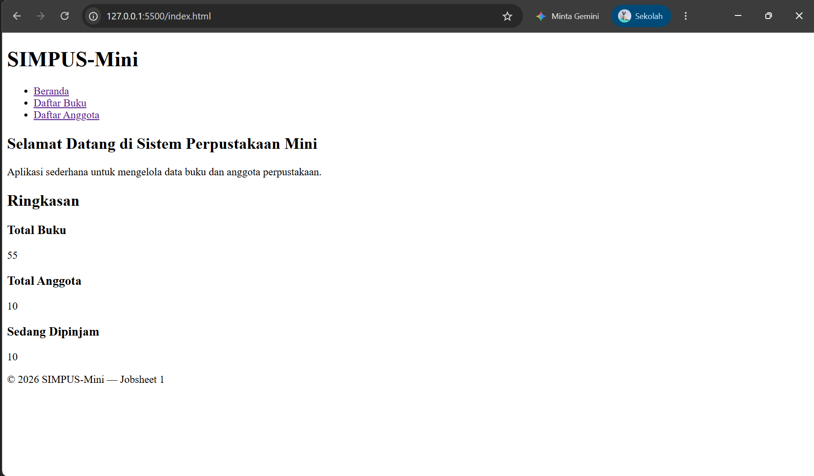
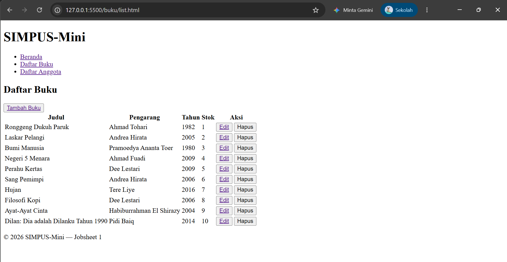
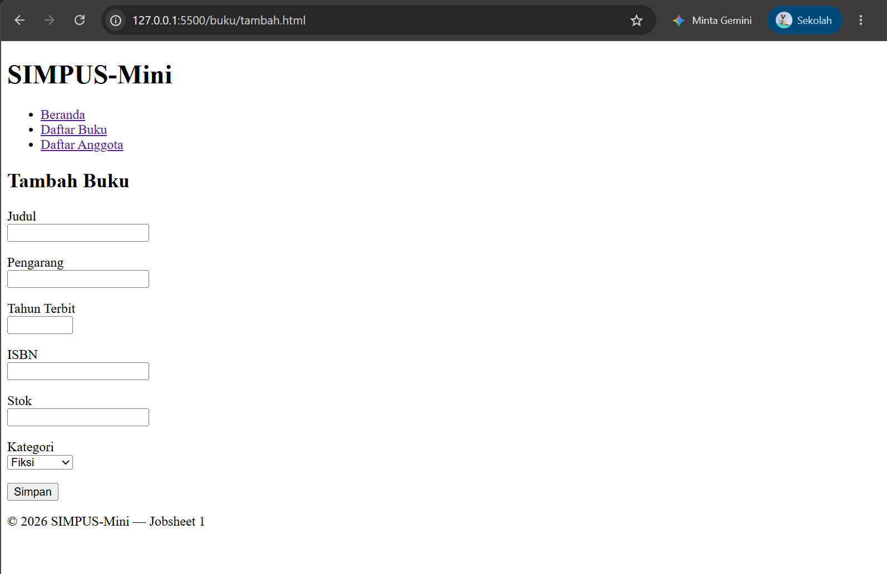
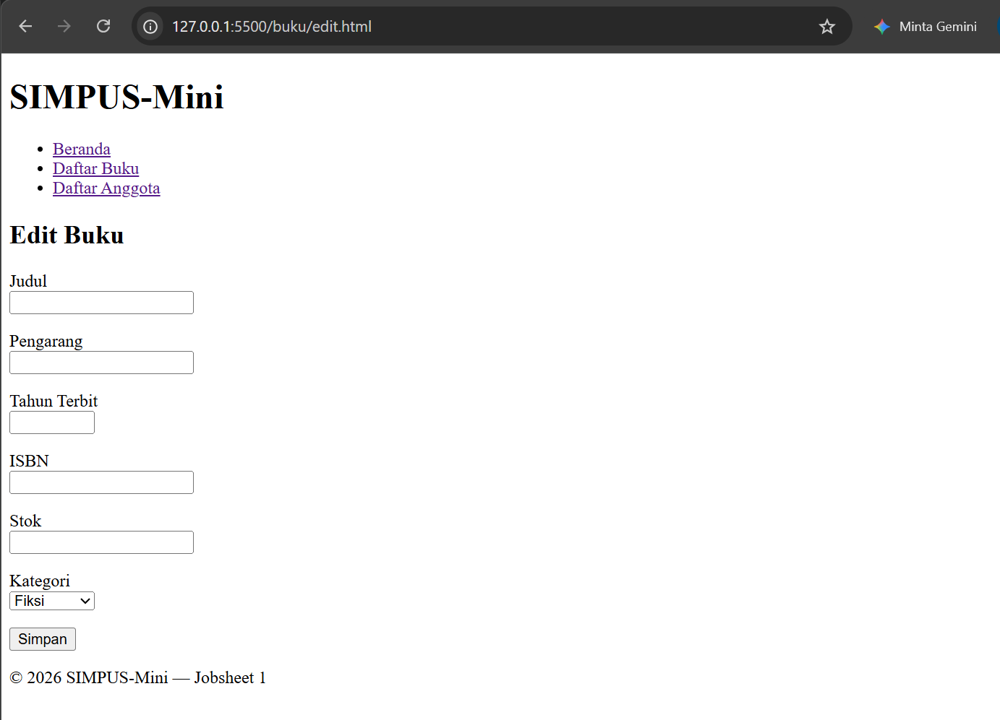
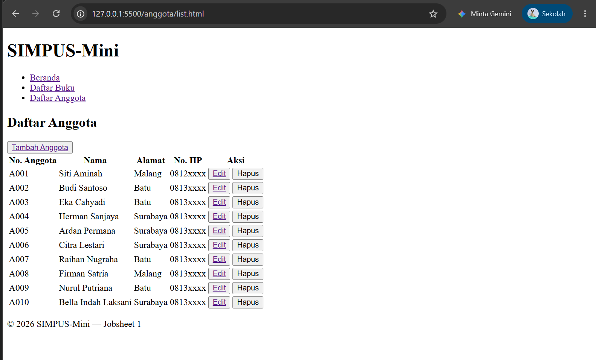
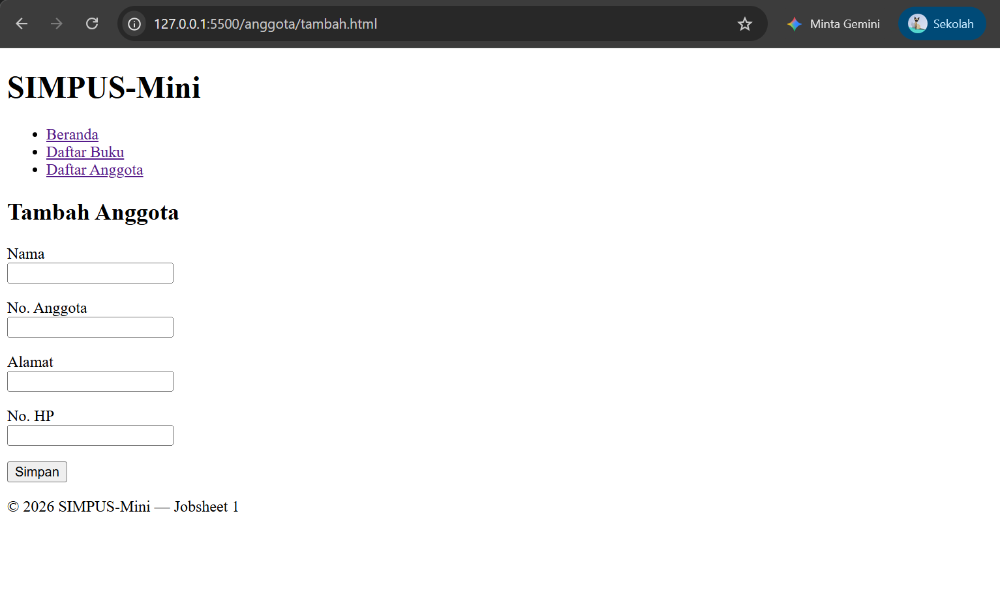
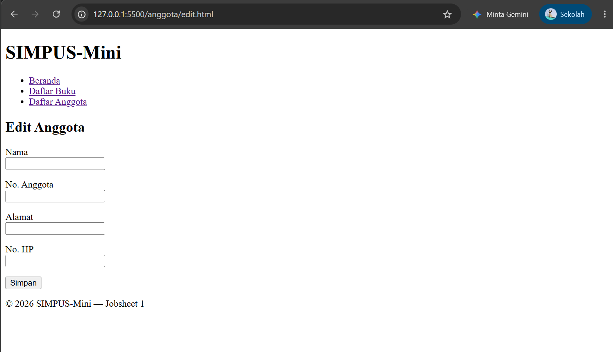

# Laporan Praktikum Jobsheet 1

## HTML5 Semantic Skeleton

### Identitas

| Keterangan | Isi |
|---|---|
| Nama | Haikal Maghsin |
| NIM | 254107020189 |
| Kelas | TI 2D |
| Mata Kuliah | Desain dan Pemrograman Web |

## 1. Tujuan

Tujuan dari praktikum ini adalah:

1. Mengenal struktur dasar HTML5.
2. Membuat beberapa halaman web sederhana.
3. Menggunakan tag semantik seperti `header`, `nav`, `main`, `section`, `article`, dan `footer`.
4. Membuat tabel untuk menampilkan data.
5. Membuat form untuk memasukkan data.
6. Menghubungkan satu halaman dengan halaman lain.

## 2. Alat yang Digunakan

Alat yang saya gunakan pada praktikum ini adalah:

- Laptop.
- Visual Studio Code.
- Browser Google Chrome.
- Live Server.
- HTML5.

Live Server saya gunakan agar lebih mudah membuka dan melihat perubahan halaman di browser. Halaman sebenarnya juga bisa dibuka langsung karena belum menggunakan database atau server.

## 3. Dasar Teori

HTML adalah bahasa yang digunakan untuk membuat struktur halaman web. Pada HTML5 terdapat tag semantik. Tag semantik adalah tag yang namanya menjelaskan fungsi bagian halaman.

Contohnya:

- `header` untuk bagian atas halaman.
- `nav` untuk menu.
- `main` untuk isi utama.
- `section` untuk membagi isi menjadi beberapa bagian.
- `article` untuk membungkus informasi yang berdiri sendiri.
- `footer` untuk bagian bawah halaman.

Pada Jobsheet 1 belum digunakan CSS dan JavaScript. Oleh karena itu, tampilan halaman masih mengikuti tampilan bawaan browser.

## 4. Struktur Folder

Struktur folder yang saya buat adalah sebagai berikut:

```text
.
├── index.html
├── buku/
│   ├── list.html
│   ├── tambah.html
│   └── edit.html
├── anggota/
│   ├── list.html
│   ├── tambah.html
│   └── edit.html
└── Dokumentasi/
    └── img/
        └── Jobsheet1/
```

Folder `buku` digunakan untuk halaman yang berhubungan dengan buku. Folder `anggota` digunakan untuk halaman yang berhubungan dengan anggota perpustakaan.

## 5. Langkah Pengerjaan

### 5.1 Membuat Halaman Beranda

Pertama, saya membuat file `index.html` sebagai halaman utama. Halaman ini berisi judul SIMPUS-Mini, menu navigasi, tulisan selamat datang, dan ringkasan data.

Ringkasan yang ditampilkan adalah:

- Total buku sebanyak 55.
- Total anggota sebanyak 10.
- Buku yang sedang dipinjam sebanyak 10.

Data tersebut masih berupa data contoh yang ditulis langsung di HTML.



### 5.2 Membuat Navigasi

Menu utama yang saya gunakan adalah Beranda, Daftar Buku, dan Daftar Anggota.

```html
<nav>
    <ul>
        <li><a href="index.html">Beranda</a></li>
        <li><a href="buku/list.html">Daftar Buku</a></li>
        <li><a href="anggota/list.html">Daftar Anggota</a></li>
    </ul>
</nav>
```

Saya tidak memasukkan Tambah Buku dan Tambah Anggota ke menu utama. Saya menaruh tombol tambah di halaman daftar masing-masing agar menu utama tetap sederhana.

Untuk kembali ke halaman utama dari dalam folder, saya menggunakan `../index.html`. Tanda `../` digunakan untuk naik satu folder.

### 5.3 Membuat Halaman Daftar Buku

Setelah itu, saya membuat halaman `buku/list.html`. Halaman ini berisi tabel dengan kolom judul, pengarang, tahun, stok, dan aksi.

Awalnya terdapat lima data buku. Saya menambahkan beberapa data lagi sehingga menjadi sepuluh data buku.

Pada bagian atas tabel terdapat tombol Tambah Buku. Pada setiap baris juga terdapat tombol Edit dan Hapus. Tombol Edit sudah dapat membuka halaman edit, tetapi tombol Hapus belum dapat menghapus data.



### 5.4 Membuat Form Tambah Buku

Halaman `buku/tambah.html` berisi form untuk memasukkan data buku. Isian yang tersedia adalah:

- Judul.
- Pengarang.
- Tahun terbit.
- ISBN.
- Stok.
- Kategori.

Beberapa input menggunakan atribut `required` agar tidak boleh kosong. Input tahun terbit juga dibatasi dari tahun 1900 sampai 2026.

```html
<label for="tahun">Tahun Terbit</label>
<input
    type="number"
    id="tahun"
    name="tahun"
    min="1900"
    max="2026"
    required
>
```



### 5.5 Membuat Halaman Edit Buku

Saya menambahkan halaman `buku/edit.html` sebagai tambahan dari saya sendiri. Isi formnya hampir sama dengan halaman tambah buku.

Halaman edit sudah bisa dibuka melalui tombol Edit pada daftar buku. Namun, form tersebut belum dapat mengambil dan mengubah data karena masih berupa HTML.



### 5.6 Membuat Halaman Daftar Anggota

Selanjutnya, saya membuat halaman `anggota/list.html`. Halaman ini menampilkan nomor anggota, nama, alamat, nomor HP, dan aksi.

Saya membuat sepuluh data anggota dengan nomor dari `A001` sampai `A010`. Pada halaman ini juga terdapat tombol Tambah Anggota, Edit, dan Hapus.



### 5.7 Membuat Form Tambah Anggota

Halaman `anggota/tambah.html` berisi form dengan isian:

- Nama.
- Nomor anggota.
- Alamat.
- Nomor HP.

Nama dan nomor anggota wajib diisi karena menggunakan atribut `required`. Setiap input juga memiliki atribut `id` dan `name`.



### 5.8 Membuat Halaman Edit Anggota

Saya juga menambahkan halaman `anggota/edit.html`. Halaman ini menggunakan form yang hampir sama dengan form tambah anggota.

Tombol Edit pada daftar anggota sudah mengarah ke halaman ini. Data masih belum dapat berubah karena belum ada proses penyimpanan.



## 6. Improvisasi

Selain mengikuti isi jobsheet, saya melakukan beberapa improvisasi:

1. Menambah data buku menjadi sepuluh data.
2. Membuat sepuluh data anggota.
3. Menambahkan tombol Tambah Buku dan Tambah Anggota pada halaman daftar.
4. Membuat halaman Edit Buku.
5. Membuat halaman Edit Anggota.
6. Membuat menu utama hanya berisi tiga halaman utama.
7. Mengubah jumlah pada bagian ringkasan beranda.

Improvisasi yang saya buat masih menggunakan HTML karena materi Jobsheet 1 memang belum membahas CSS dan JavaScript.

## 7. Hasil Pengujian

| No. | Pengujian | Hasil |
|---:|---|---|
| 1 | Membuka halaman beranda | Berhasil |
| 2 | Membuka halaman daftar buku | Berhasil |
| 3 | Membuka halaman daftar anggota | Berhasil |
| 4 | Membuka form tambah buku | Berhasil |
| 5 | Membuka form edit buku | Berhasil |
| 6 | Membuka form tambah anggota | Berhasil |
| 7 | Membuka form edit anggota | Berhasil |
| 8 | Mencoba mengirim form kosong | Muncul peringatan pada input wajib |
| 9 | Mencoba tombol Hapus | Belum berfungsi |
| 10 | Mencoba menyimpan data | Belum berfungsi |

## 8. Kendala

Hal yang perlu saya perhatikan adalah penulisan alamat file. File yang berada di dalam folder `buku` atau `anggota` harus menggunakan `../` untuk kembali ke halaman utama.

Selain itu, tombol Simpan dan Hapus belum dapat mengubah data. Hal tersebut terjadi karena pada Jobsheet 1 baru digunakan HTML dan belum ada JavaScript atau database.

## 9. Kesimpulan

Pada Jobsheet 1 ini saya berhasil membuat halaman sederhana untuk SIMPUS-Mini. Halaman yang dibuat terdiri dari beranda, daftar buku, tambah buku, edit buku, daftar anggota, tambah anggota, dan edit anggota.

Dari praktikum ini saya mulai memahami struktur dasar HTML, penggunaan tag semantik, tabel, form, dan cara menghubungkan halaman menggunakan link. Saya juga memahami bahwa HTML hanya membuat struktur halaman. Agar data dapat ditambah, diedit, atau dihapus, masih diperlukan materi lain seperti JavaScript atau backend.
