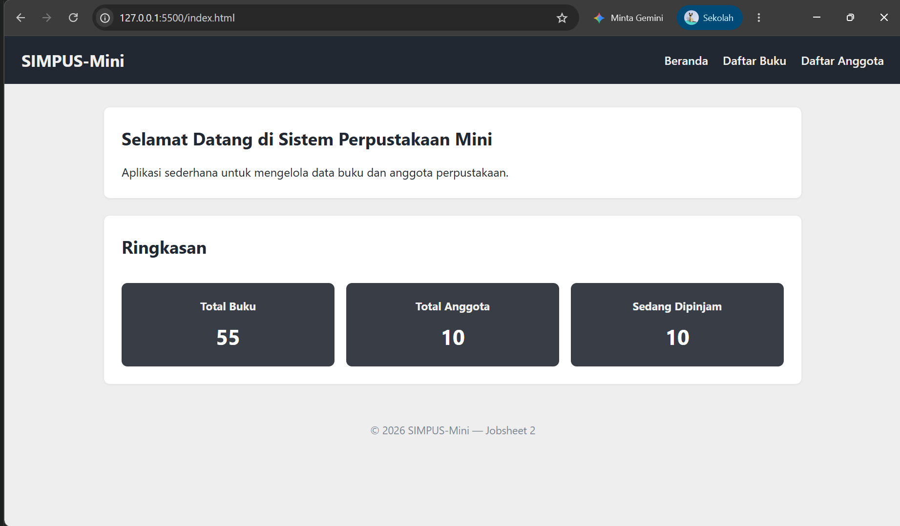
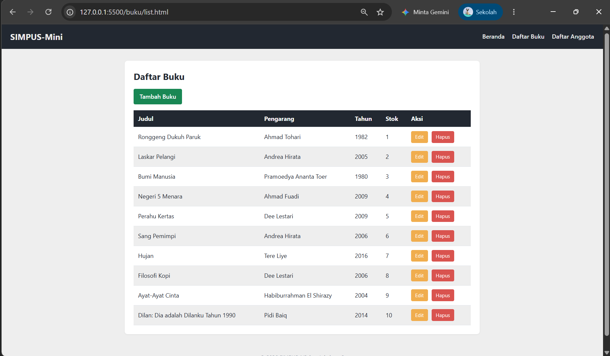
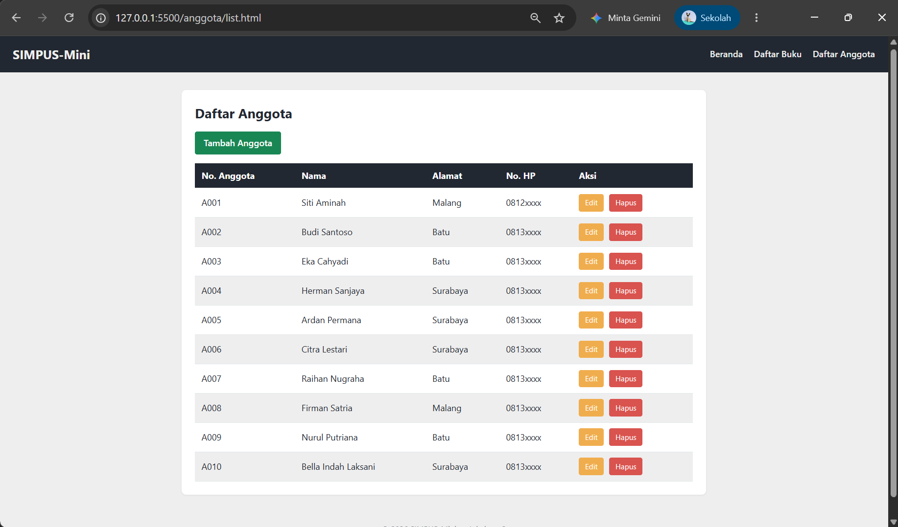
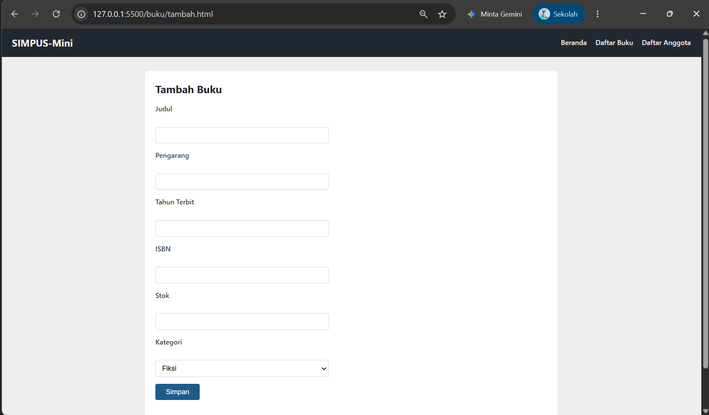
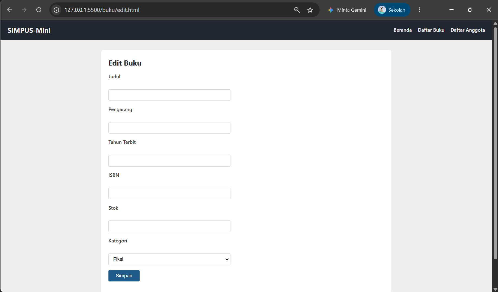
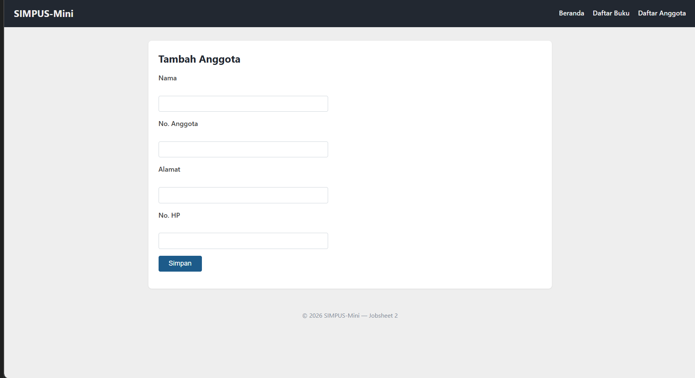
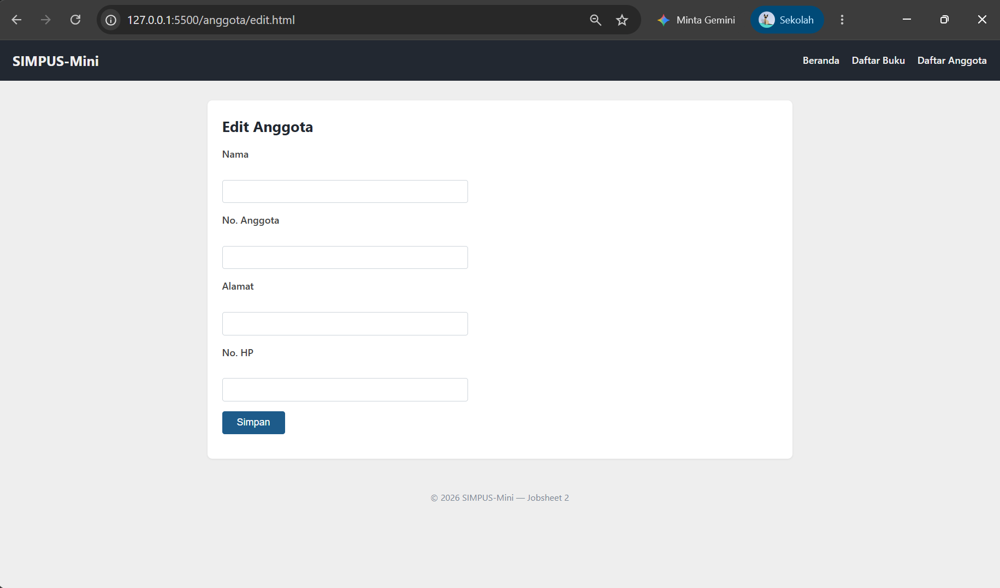

# Laporan Praktikum Jobsheet 2

## CSS3 Styling Dasar

### Identitas

| Keterangan | Isi |
|---|---|
| Nama | Haikal Maghsin |
| NIM | 254107020189 |
| Kelas | TI 2D |
| Mata Kuliah | Desain dan Pemrograman Web |

## 1. Tujuan

Tujuan dari praktikum ini adalah:

1. Menghubungkan halaman HTML dengan file CSS.
2. Mengatur warna, ukuran, dan jarak pada halaman.
3. Menggunakan Flexbox untuk navigasi.
4. Menggunakan CSS Grid untuk kartu ringkasan.
5. Membuat tabel, form, dan tombol menjadi lebih rapi.

## 2. Alat yang Digunakan

- Visual Studio Code.
- Browser Google Chrome.
- Live Server.
- HTML5.
- CSS3.

## 3. Langkah Pengerjaan

### 3.1 Menghubungkan CSS

Saya membuat file `assets/css/style.css`. File tersebut digunakan oleh semua halaman agar tampilannya sama.

Pada halaman utama, CSS dipanggil dengan:

```html
<link rel="stylesheet" href="assets/css/style.css">
```

Pada halaman di dalam folder `buku` dan `anggota`, saya menggunakan `../` karena posisi filenya berbeda.

```html
<link rel="stylesheet" href="../assets/css/style.css">
```

### 3.2 Menentukan Warna

Saya menggunakan beberapa variabel warna agar warna pada CSS lebih mudah digunakan kembali.

```css
:root {
    --warna-gelap: #222831;
    --warna-abu: #393E46;
    --warna-aksen: #00ADB5;
    --warna-terang: #EEEEEE;
    --warna-putih: #FFFFFF;
}
```

Warna gelap digunakan pada header dan header tabel. Warna abu-abu digunakan pada kartu ringkasan, sedangkan warna terang digunakan sebagai latar halaman. Warna teal hanya digunakan sebagai aksen ketika menu terkena kursor.

### 3.3 Mengatur Header dan Navigasi

Header diberi warna gelap dengan teks terang. Saya menggunakan Flexbox agar judul berada di sebelah kiri dan menu berada di sebelah kanan.

```css
header {
    display: flex;
    align-items: center;
    justify-content: space-between;
    flex-wrap: wrap;
}
```

Ketika menu terkena kursor, warnanya berubah menjadi teal menggunakan `:hover`.

### 3.4 Mengatur Konten dan Kartu Ringkasan

Lebar konten utama dibatasi agar tidak memenuhi seluruh layar. Setiap `section` diberi latar putih, padding, sudut membulat, dan bayangan tipis.

Tiga kartu ringkasan disusun menggunakan CSS Grid:

```css
main section:nth-of-type(2) {
    display: grid;
    grid-template-columns: repeat(3, 1fr);
    gap: 1rem;
}
```

Judul Ringkasan dibuat memenuhi satu baris agar tidak mendorong kartu terakhir ke baris berikutnya.

```css
main section:nth-of-type(2) h2 {
    grid-column: 1 / -1;
}
```

Kartu menggunakan warna `#393E46`, sedangkan judul dan angkanya menggunakan warna terang.



### 3.5 Mengatur Tabel dan Tombol

Tabel dibuat selebar bagian konten. Header tabel diberi warna gelap, baris genap diberi warna abu-abu terang, dan baris akan berubah warna ketika terkena kursor.

Tombol dibedakan berdasarkan fungsinya:

- Tambah menggunakan warna hijau.
- Edit menggunakan warna oranye.
- Hapus menggunakan warna merah.
- Simpan menggunakan warna biru.

Tombol Tambah dan Edit menggunakan elemen `a` karena membuka halaman lain. Tombol Hapus menggunakan elemen `button` karena nantinya akan menjalankan proses penghapusan.

```html
<a href="edit.html" class="btn-aksi btn-edit">Edit</a>
<button type="button" class="btn-aksi btn-hapus">Hapus</button>
```

Class `btn-aksi` digunakan untuk menyamakan ukuran tombol. Class `btn-edit` dan `btn-hapus` digunakan untuk membedakan warnanya.

#### Hasil halaman daftar buku



#### Hasil halaman daftar anggota



### 3.6 Mengatur Form

Input dan pilihan kategori diberi padding, border, dan sudut membulat. Lebarnya dibatasi maksimal 400 piksel agar form tidak terlalu panjang.

Label dibuat lebih tebal supaya nama field mudah dibaca. Tombol Simpan diberi warna biru dan berubah menjadi lebih gelap ketika terkena kursor.

#### Form tambah buku



#### Form edit buku



#### Form tambah anggota



#### Form edit anggota



### 3.7 Mengatur Footer

Footer dibuat rata tengah. Ukuran tulisannya dibuat lebih kecil dan warnanya dibuat abu-abu agar tidak lebih menonjol daripada isi utama.

## 4. Improvisasi

Improvisasi yang saya lakukan pada Jobsheet 2 adalah:

1. Membuat judul Ringkasan memenuhi satu baris Grid.
2. Menggunakan palet warna gelap dan netral.
3. Membuat variabel warna menggunakan `:root`.
4. Membuat class khusus untuk tombol Tambah, Edit, dan Hapus.
5. Memperbaiki tombol yang sebelumnya menggunakan `button` dan `a` secara bersamaan.
6. Memberikan efek `hover` pada menu, tombol, dan tabel.
7. Menerapkan CSS yang sama pada halaman tambah dan edit.

## 5. Hasil Pengujian

| No. | Pengujian | Hasil |
|---:|---|---|
| 1 | CSS tampil pada halaman utama | Berhasil |
| 2 | CSS tampil pada halaman buku dan anggota | Berhasil |
| 3 | Navigasi tersusun menggunakan Flexbox | Berhasil |
| 4 | Tiga kartu ringkasan tampil sejajar | Berhasil |
| 5 | Tabel memiliki warna dan efek hover | Berhasil |
| 6 | Tombol Tambah membuka halaman tambah | Berhasil |
| 7 | Tombol Edit membuka halaman edit | Berhasil |
| 8 | Validasi field wajib tetap berjalan | Berhasil |
| 9 | Tombol Hapus menghapus data | Belum tersedia |
| 10 | Form menyimpan data | Belum tersedia |

## 6. Kendala

Kartu ringkasan sempat tidak sejajar karena judul `h2` ikut dihitung sebagai item Grid. Masalah tersebut diselesaikan menggunakan `grid-column: 1 / -1`.

CSS juga sempat tidak berubah karena saya mengedit file referensi di folder `kode-praktikum`. Setelah memeriksa path pada `index.html`, saya melanjutkan perubahan pada `assets/css/style.css` yang digunakan proyek utama.

Pada tombol Tambah dan Edit sempat muncul kotak ganda karena elemen `a` diletakkan di dalam `button`. Saya memperbaikinya dengan menggunakan elemen `a` saja, kemudian membuat tampilannya seperti tombol menggunakan CSS.

## 7. Kesimpulan

Pada Jobsheet 2 saya belajar bahwa satu file CSS dapat digunakan untuk mengatur tampilan beberapa halaman. Saya menggunakan Flexbox untuk navigasi, CSS Grid untuk kartu ringkasan, dan class untuk mengatur tombol.

Tampilan SIMPUS-Mini sekarang lebih rapi dan memiliki warna yang konsisten. Fitur tambah, edit, dan hapus masih belum mengubah data karena proyek belum menggunakan JavaScript atau database.
