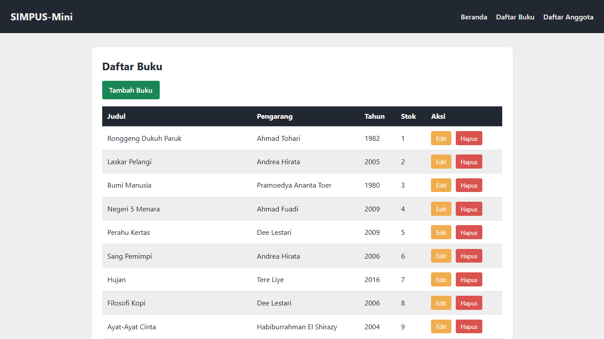
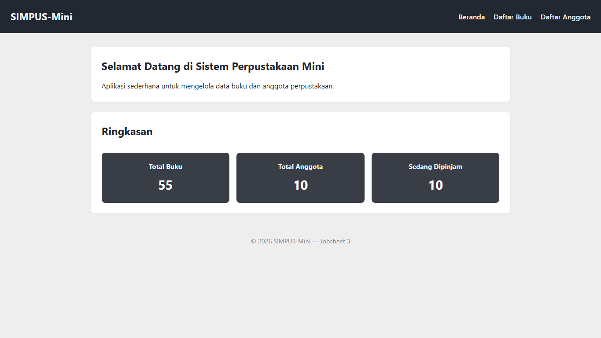

# Laporan Praktikum Jobsheet 3

## Responsive Web Design

### Identitas

| Keterangan | Isi |
|---|---|
| Nama | Haikal Maghsin |
| NIM | 254107020189 |
| Kelas | TI 2D |
| Mata Kuliah | Desain dan Pemrograman Web |

## 1. Tujuan

Tujuan dari praktikum ini adalah:

1. Memahami konsep responsive web design.
2. Menambahkan tag `meta viewport` pada semua halaman.
3. Membuat navigasi responsif menggunakan hamburger menu.
4. Membuat tabel dapat digeser horizontal pada layar kecil.
5. Mengatur tampilan kartu ringkasan menggunakan media query.
6. Menggabungkan materi Jobsheet 3 dengan proyek SIMPUS-Mini yang sudah dibuat pada Jobsheet 1 dan Jobsheet 2.

## 2. Alat yang Digunakan

Alat yang saya gunakan pada praktikum ini adalah:

- Laptop.
- Visual Studio Code.
- Browser Google Chrome.
- Live Server.
- HTML5.
- CSS3.

## 3. Dasar Teori

Responsive web design adalah teknik membuat tampilan web agar dapat menyesuaikan diri dengan ukuran layar pengguna. Dengan responsive design, satu halaman web dapat tetap nyaman dibuka melalui laptop, tablet, maupun handphone.

Pada Jobsheet 3 digunakan beberapa konsep utama:

- `meta viewport` agar browser mengikuti lebar layar perangkat.
- Media query untuk memberi aturan CSS pada ukuran layar tertentu.
- Hamburger menu untuk menyederhanakan navigasi pada layar kecil.
- Wrapper tabel responsif agar tabel tetap terbaca tanpa merusak layout.

## 4. Struktur Folder

Folder Jobsheet 3 dibuat terpisah agar tidak merusak hasil Jobsheet 1 dan Jobsheet 2.

```text
Jobsheet3/
|-- index.html
|-- assets/
|   `-- css/
|       `-- style.css
|-- buku/
|   |-- list.html
|   |-- tambah.html
|   `-- edit.html
|-- anggota/
|   |-- list.html
|   |-- tambah.html
|   `-- edit.html
|-- Dokumentasi/
`-- README.md
```

Halaman yang digunakan tetap sama dengan proyek sebelumnya, yaitu beranda, daftar buku, tambah buku, edit buku, daftar anggota, tambah anggota, dan edit anggota.

## 5. Langkah Pengerjaan

### 5.1 Menambahkan Meta Viewport

Saya menambahkan `meta viewport` pada semua halaman HTML di Jobsheet 3.

```html
<meta name="viewport" content="width=device-width, initial-scale=1">
```

Tag tersebut membuat lebar layout mengikuti lebar perangkat, sehingga aturan media query dapat bekerja dengan benar pada layar kecil.

### 5.2 Membuat Hamburger Menu

Pada bagian header, saya menambahkan checkbox dan label untuk membuat hamburger menu tanpa JavaScript.

```html
<input type="checkbox" id="nav-toggle" class="nav-toggle">
<label for="nav-toggle" class="nav-toggle-label">☰</label>
```

Checkbox tersebut disembunyikan menggunakan CSS, sedangkan labelnya tampil sebagai ikon hamburger. Ketika checkbox aktif, menu navigasi akan ditampilkan.

```css
.nav-toggle:checked ~ nav {
    display: block;
}
```

Dengan cara ini, menu dapat dibuka dan ditutup hanya menggunakan HTML dan CSS.

### 5.3 Membuat Tabel Responsif

Tabel pada halaman daftar buku dan daftar anggota dibungkus dengan elemen `div` ber-class `table-responsive`.

```html
<div class="table-responsive">
    <table>
        ...
    </table>
</div>
```

CSS yang digunakan adalah:

```css
.table-responsive {
    max-width: 100%;
    overflow-x: auto;
}

.table-responsive table {
    min-width: 640px;
}
```

Tujuannya agar tabel tidak memaksa halaman melebar pada layar kecil. Jika kolom tabel terlalu banyak, pengguna dapat menggeser tabel ke samping.



### 5.4 Mengatur Kartu Ringkasan dengan Media Query

Kartu ringkasan dibuat responsif menggunakan pendekatan mobile-first.

```css
main section:nth-of-type(2) {
    grid-template-columns: 1fr;
}

@media (min-width: 481px) {
    main section:nth-of-type(2) {
        grid-template-columns: repeat(2, minmax(0, 1fr));
    }
}

@media (min-width: 1024px) {
    main section:nth-of-type(2) {
        grid-template-columns: repeat(3, minmax(0, 1fr));
    }
}
```

Pada layar kecil kartu tampil satu kolom. Pada ukuran tablet kartu menjadi dua kolom, dan pada desktop kartu kembali menjadi tiga kolom.



### 5.5 Menyesuaikan Form

Form tambah dan edit dibuat lebih fleksibel pada layar kecil. Input dan `select` diberi lebar penuh dengan batas maksimal tertentu.

```css
form input,
form select {
    width: 100%;
    max-width: 100%;
}
```

Pada layar yang lebih besar, lebar form dikembalikan menjadi maksimal 400 piksel agar tidak terlalu panjang.

## 6. Improvisasi

Improvisasi yang saya lakukan pada Jobsheet 3 adalah:

1. Menggabungkan materi responsif dari Jobsheet 3 Pak Dimas ke proyek SIMPUS-Mini milik saya.
2. Mempertahankan tujuh halaman dari Jobsheet 2.
3. Mempertahankan data contoh sepuluh buku dan sepuluh anggota.
4. Mempertahankan palet warna gelap, abu-abu, teal, dan putih dari Jobsheet 2.
5. Membuat hamburger menu dapat diakses menggunakan keyboard.
6. Membuat tabel daftar buku dan daftar anggota dapat digeser horizontal.
7. Menggunakan breakpoint satu kolom, dua kolom, dan tiga kolom untuk kartu ringkasan.

## 7. Hasil Pengujian

| No. | Pengujian | Hasil |
|---:|---|---|
| 1 | Halaman beranda dapat dibuka | Berhasil |
| 2 | Semua halaman memiliki `meta viewport` | Berhasil |
| 3 | CSS tampil pada halaman beranda, buku, dan anggota | Berhasil |
| 4 | Menu hamburger tampil pada layar kecil | Berhasil |
| 5 | Menu horizontal tampil pada layar desktop | Berhasil |
| 6 | Kartu ringkasan berubah sesuai ukuran layar | Berhasil |
| 7 | Tabel daftar buku dapat digeser horizontal | Berhasil |
| 8 | Tabel daftar anggota dapat digeser horizontal | Berhasil |
| 9 | Form tambah dan edit tetap rapi pada layar kecil | Berhasil |
| 10 | Tombol hapus benar-benar menghapus data | Belum tersedia |

## 8. Kendala

Kendala utama pada Jobsheet 3 adalah menyesuaikan tabel agar tetap dapat dibaca pada layar kecil. Jika tabel langsung dipaksa mengikuti lebar layar, isi kolom menjadi terlalu sempit. Masalah ini diselesaikan dengan membungkus tabel menggunakan `.table-responsive`.

Selain itu, menu hamburger perlu dibuat tanpa JavaScript karena materi masih berfokus pada HTML dan CSS. Saya menggunakan teknik checkbox hack agar menu tetap bisa dibuka dan ditutup.

## 9. Kesimpulan

Pada Jobsheet 3, saya berhasil membuat tampilan SIMPUS-Mini menjadi responsif. Halaman yang sebelumnya hanya nyaman dibuka di desktop sekarang lebih siap dibuka pada ukuran layar yang berbeda.

Dari praktikum ini saya memahami fungsi `meta viewport`, media query, hamburger menu, dan tabel responsif. Fitur penyimpanan, edit data, dan hapus data masih belum berjalan karena proyek masih berupa HTML dan CSS statis.
