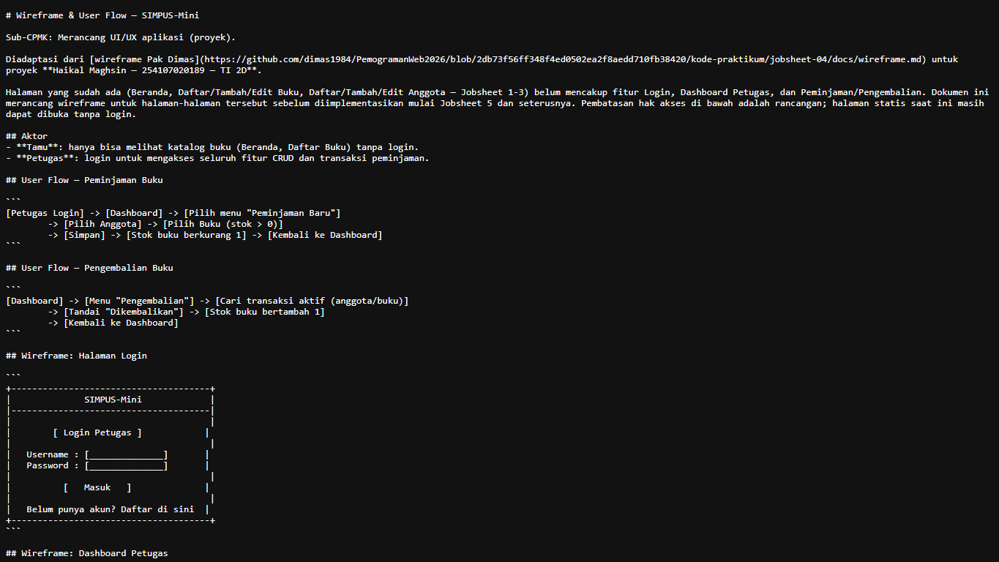
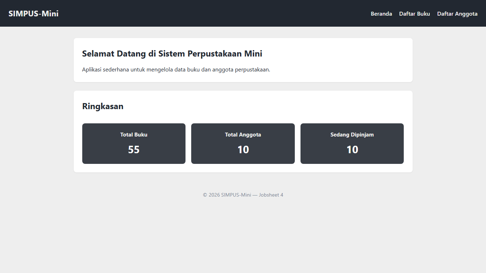
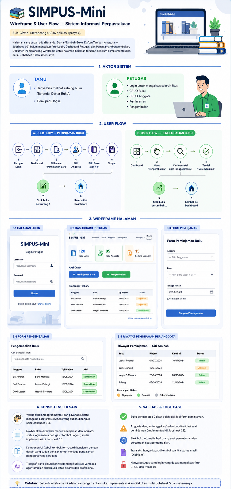

# Laporan Praktikum Jobsheet 4

## Rancangan UI/UX

### Identitas

| Keterangan | Isi |
|---|---|
| Nama | Haikal Maghsin |
| NIM | 254107020189 |
| Kelas | TI 2D |
| Mata Kuliah | Desain dan Pemrograman Web |

## 1. Tujuan

Tujuan dari praktikum ini adalah:

1. Memahami proses awal perancangan UI/UX aplikasi web.
2. Menentukan aktor yang menggunakan aplikasi.
3. Membuat rancangan user flow untuk fitur peminjaman dan pengembalian buku.
4. Membuat wireframe untuk halaman yang akan dikembangkan pada jobsheet berikutnya.
5. Menyesuaikan rancangan Jobsheet 4 dengan proyek SIMPUS-Mini milik saya.

## 2. Alat yang Digunakan

Alat yang saya gunakan pada praktikum ini adalah:

- Laptop.
- Visual Studio Code.
- Browser Google Chrome.
- Markdown Preview di Visual Studio Code.
- HTML5.
- CSS3.

## 3. Dasar Teori

UI atau user interface adalah tampilan yang dilihat dan digunakan oleh pengguna. UX atau user experience adalah pengalaman pengguna saat memakai aplikasi, termasuk kemudahan alur, kejelasan tombol, dan kenyamanan saat menyelesaikan tugas.

Pada Jobsheet 4, fokus utama bukan menambah kode baru, tetapi membuat rancangan. Rancangan tersebut dibuat dalam bentuk wireframe dan user flow.

Wireframe adalah sketsa sederhana dari susunan halaman. User flow adalah alur langkah pengguna ketika menjalankan suatu proses, misalnya meminjam buku atau mengembalikan buku.

## 4. Struktur Folder

Folder Jobsheet 4 dibuat sebagai kelanjutan dari Jobsheet 3.

```text
Jobsheet4/
|-- index.html
|-- assets/
|   `-- css/
|       `-- style.css
|-- buku/
|   |-- list.html
|   |-- tambah.html
|   `-- edit.html
|-- anggota/
|   |-- list.html
|   |-- tambah.html
|   `-- edit.html
|-- docs/
|   `-- wireframe.md
|-- Dokumentasi/
|-- Infografis.png
`-- README.md
```

Kode HTML dan CSS pada Jobsheet 4 masih meneruskan hasil Jobsheet 3. Bagian baru terdapat pada rancangan `docs/wireframe.md`.

## 5. Langkah Pengerjaan

### 5.1 Menentukan Aktor

Saya menentukan dua aktor utama pada aplikasi SIMPUS-Mini, yaitu Tamu dan Petugas.

| Aktor | Hak Akses |
|---|---|
| Tamu | Melihat beranda dan daftar buku |
| Petugas | Login, mengelola data buku, mengelola data anggota, dan mencatat transaksi |

Pembagian aktor ini dibuat agar rancangan aplikasi lebih jelas. Tidak semua pengguna perlu memiliki akses ke fitur tambah, edit, hapus, peminjaman, dan pengembalian.

### 5.2 Membuat User Flow Peminjaman Buku

Alur peminjaman buku dirancang dari proses login petugas sampai stok buku berkurang.

```text
Petugas Login
-> Dashboard
-> Pilih menu Peminjaman Baru
-> Pilih Anggota
-> Pilih Buku dengan stok tersedia
-> Simpan
-> Stok buku berkurang
-> Kembali ke Dashboard
```

Pada rancangan ini, buku dengan stok habis tidak boleh dipilih saat transaksi peminjaman.

### 5.3 Membuat User Flow Pengembalian Buku

Alur pengembalian buku dirancang agar petugas dapat mencari transaksi aktif, lalu menandai buku sebagai sudah dikembalikan.

```text
Dashboard
-> Menu Pengembalian
-> Cari transaksi aktif
-> Tandai Dikembalikan
-> Stok buku bertambah
-> Kembali ke Dashboard
```

Pada tahap implementasi berikutnya, alur ini perlu memastikan satu transaksi tidak diproses dua kali agar stok buku tidak bertambah secara keliru.

### 5.4 Membuat Wireframe Halaman

Wireframe dibuat untuk beberapa halaman yang belum tersedia pada Jobsheet 1 sampai Jobsheet 3, yaitu:

1. Halaman Login.
2. Dashboard Petugas.
3. Form Peminjaman.
4. Form Pengembalian.
5. Riwayat Peminjaman per Anggota.

Contoh rancangan halaman login:

```text
+--------------------------------------+
|              SIMPUS-Mini             |
|--------------------------------------|
|                                      |
|        [ Login Petugas ]             |
|                                      |
|   Username : [______________]        |
|   Password : [______________]        |
|                                      |
|          [   Masuk   ]               |
|                                      |
+--------------------------------------+
```

Wireframe lengkap disimpan pada file `Jobsheet4/docs/wireframe.md`.



### 5.5 Menyesuaikan dengan Tampilan SIMPUS-Mini

Rancangan UI/UX disesuaikan dengan tampilan yang sudah ada sejak Jobsheet 2 dan Jobsheet 3. Warna, bentuk tombol, tabel, kartu ringkasan, dan form mengikuti CSS lokal proyek.

| Komponen | Gaya yang Digunakan |
|---|---|
| Header | Warna gelap `#222831` |
| Kartu statistik | Abu-abu gelap `#393E46` |
| Aksen navigasi | Teal `#00ADB5` |
| Tombol tambah | Hijau |
| Tombol edit | Oranye |
| Tombol hapus | Merah |
| Tombol simpan | Biru |



### 5.6 Menggunakan Infografis

Jobsheet 4 juga menyertakan infografis sebagai bahan pendukung untuk memahami konsep UI/UX.



## 6. Improvisasi

Improvisasi yang saya lakukan pada Jobsheet 4 adalah:

1. Menggabungkan materi Jobsheet 4 Pak Dimas dengan proyek SIMPUS-Mini.
2. Menyesuaikan aktor dan alur dengan kebutuhan aplikasi perpustakaan.
3. Menambahkan rancangan kondisi khusus seperti stok habis dan anggota yang memiliki tunggakan.
4. Membuat pemetaan antara halaman yang sudah ada dan halaman yang akan dibuat berikutnya.
5. Mempertahankan tampilan responsif dari Jobsheet 3.
6. Menambahkan panduan warna agar rancangan berikutnya tetap konsisten.

## 7. Hasil Pengujian

| No. | Pengujian | Hasil |
|---:|---|---|
| 1 | Halaman Jobsheet 4 dapat dibuka | Berhasil |
| 2 | CSS Jobsheet 4 tampil dengan benar | Berhasil |
| 3 | File `docs/wireframe.md` tersedia | Berhasil |
| 4 | Aktor Tamu dan Petugas sudah dijelaskan | Berhasil |
| 5 | User flow peminjaman sudah dibuat | Berhasil |
| 6 | User flow pengembalian sudah dibuat | Berhasil |
| 7 | Wireframe login tersedia | Berhasil |
| 8 | Wireframe dashboard tersedia | Berhasil |
| 9 | Wireframe transaksi tersedia | Berhasil |
| 10 | Login dan transaksi sudah berjalan secara nyata | Belum tersedia |

## 8. Kendala

Pada Jobsheet 4 belum ada penambahan fitur yang berjalan secara nyata. Login, peminjaman, pengembalian, dan riwayat masih berupa rancangan. Hal ini sesuai dengan fokus Jobsheet 4, yaitu membuat rancangan UI/UX sebelum masuk ke tahap implementasi.

Kendala lainnya adalah menentukan alur transaksi agar tidak membingungkan. Saya menyelesaikannya dengan membuat user flow sederhana dari awal sampai akhir, lalu menambahkan kondisi khusus seperti stok habis dan transaksi yang sudah dikembalikan.

## 9. Kesimpulan

Pada Jobsheet 4, saya berhasil membuat rancangan UI/UX untuk pengembangan SIMPUS-Mini. Rancangan tersebut mencakup aktor, user flow, wireframe, dan hubungan dengan halaman yang sudah dibuat sebelumnya.

Dari praktikum ini saya memahami bahwa pembuatan aplikasi tidak hanya dimulai dari kode, tetapi juga perlu dirancang terlebih dahulu. Dengan adanya wireframe dan user flow, fitur berikutnya seperti login, dashboard, peminjaman, pengembalian, dan riwayat dapat dibuat dengan arah yang lebih jelas.
