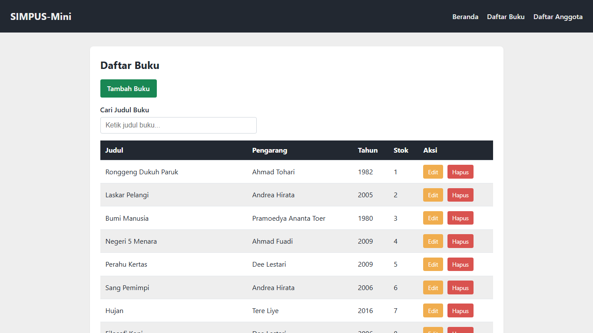
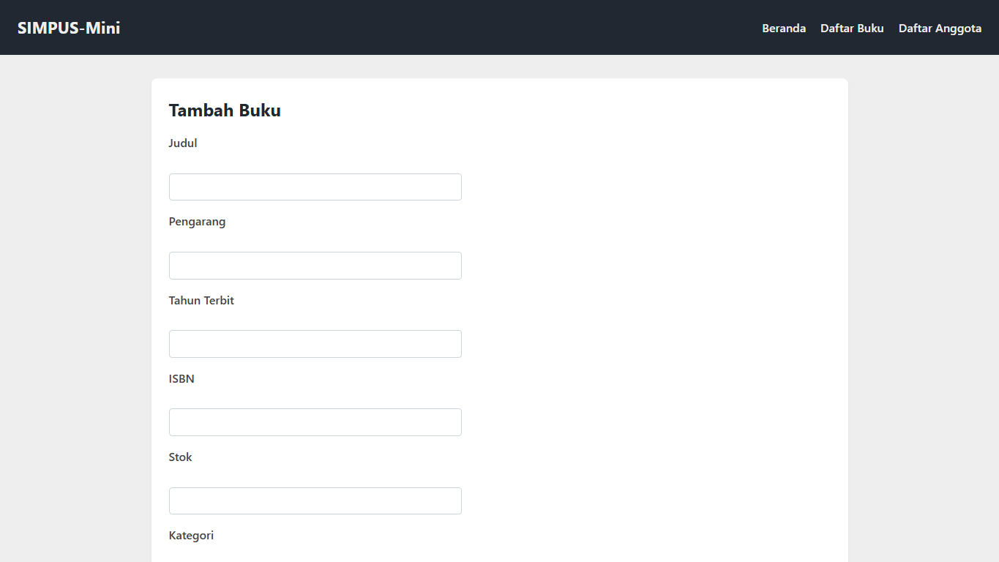

# Laporan Praktikum Jobsheet 5

## JavaScript DOM & Event

### Identitas

| Keterangan | Isi |
|---|---|
| Nama | Haikal Maghsin |
| NIM | 254107020189 |
| Kelas | TI 2D |
| Mata Kuliah | Desain dan Pemrograman Web |

## 1. Tujuan

Tujuan Jobsheet 5 adalah menambahkan interaksi JavaScript pada halaman SIMPUS-Mini. Setelah saya cek repo Pak Dimas, tugas pada jobsheet ini berfokus pada DOM, event, validasi form, filter tabel, hamburger menu dengan JavaScript, dan konfirmasi hapus.

## 2. Langkah Pengerjaan

Saya membuat folder `Jobsheet5` sebagai kelanjutan dari Jobsheet 4. Tujuh halaman sebelumnya tetap dipertahankan, yaitu beranda, daftar/tambah/edit buku, dan daftar/tambah/edit anggota.

Perubahan utama ada pada file `assets/js/app.js`. File ini dipanggil oleh semua halaman agar interaksi JavaScript bisa dipakai bersama.

### 2.1 Hamburger Menu dengan JavaScript

Pada Jobsheet 3 dan 4, hamburger menu masih memakai checkbox hack. Pada Jobsheet 5 saya menggantinya dengan tombol:

```html
<button type="button" id="nav-toggle-btn" class="nav-toggle-label">
    &#9776;
</button>
```

Ketika tombol diklik, JavaScript menambah atau menghapus class `nav-open` pada elemen navigasi.

### 2.2 Filter Daftar Buku dan Anggota

Saya menambahkan kotak pencarian pada halaman daftar buku dan daftar anggota. Ketika pengguna mengetik, JavaScript membaca isi setiap baris tabel lalu menyembunyikan baris yang tidak cocok.



### 2.3 Konfirmasi Hapus

Tombol Hapus sekarang menampilkan `confirm()`. Jika pengguna memilih OK, baris dihapus dari tampilan.

Fitur ini masih bersifat front-end. Data belum benar-benar terhapus dari database karena proyek belum memakai backend.

### 2.4 Validasi Form

Form tambah dan edit diberi validasi client-side. Jika input wajib kosong, tahun berada di luar 1900-2026, atau stok bernilai negatif, maka JavaScript menampilkan pesan error di dekat input.



## 3. Improvisasi

Saya tidak hanya memakai empat halaman dari contoh Pak Dimas, tetapi tetap mempertahankan halaman edit buku dan edit anggota yang sudah dibuat sejak jobsheet awal. Validasi juga saya pasang pada form tambah dan edit agar perilakunya konsisten.

Tema warna dan data contoh milik saya tetap dipakai supaya hasil Jobsheet 5 terasa menyatu dengan Jobsheet 1 sampai 4.

## 4. Hasil Pengujian

| No. | Pengujian | Hasil |
|---:|---|---|
| 1 | Tombol hamburger membuka dan menutup menu | Berhasil |
| 2 | Pencarian daftar buku menyaring baris tabel | Berhasil |
| 3 | Pencarian daftar anggota menyaring baris tabel | Berhasil |
| 4 | Tombol Hapus menampilkan konfirmasi | Berhasil |
| 5 | Baris hilang dari tampilan setelah hapus dikonfirmasi | Berhasil |
| 6 | Form kosong menampilkan pesan error | Berhasil |
| 7 | Tahun di luar rentang ditolak | Berhasil |
| 8 | Stok negatif ditolak | Berhasil |

## 5. Kendala

Bagian yang perlu diperhatikan adalah fitur hapus belum permanen. Ketika halaman dimuat ulang, data akan kembali seperti semula karena datanya masih ditulis di HTML.

Selain itu, validasi JavaScript hanya berjalan di browser. Pada aplikasi nyata, validasi tetap perlu dibuat lagi di sisi server.

## 6. Kesimpulan

Pada Jobsheet 5 saya berhasil menambahkan interaksi JavaScript ke SIMPUS-Mini. Halaman tidak lagi sekadar statis karena pengguna bisa membuka menu, mencari data, menghapus baris dari tampilan, dan mendapat pesan validasi saat mengisi form.

Materi ini menjadi dasar sebelum data mulai dipisahkan ke JSON dan dimuat secara dinamis pada Jobsheet 6.
